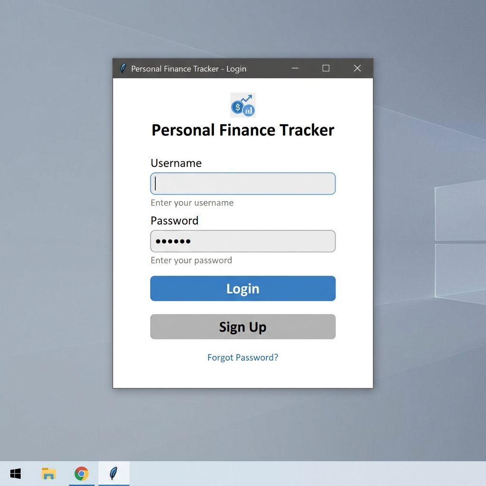
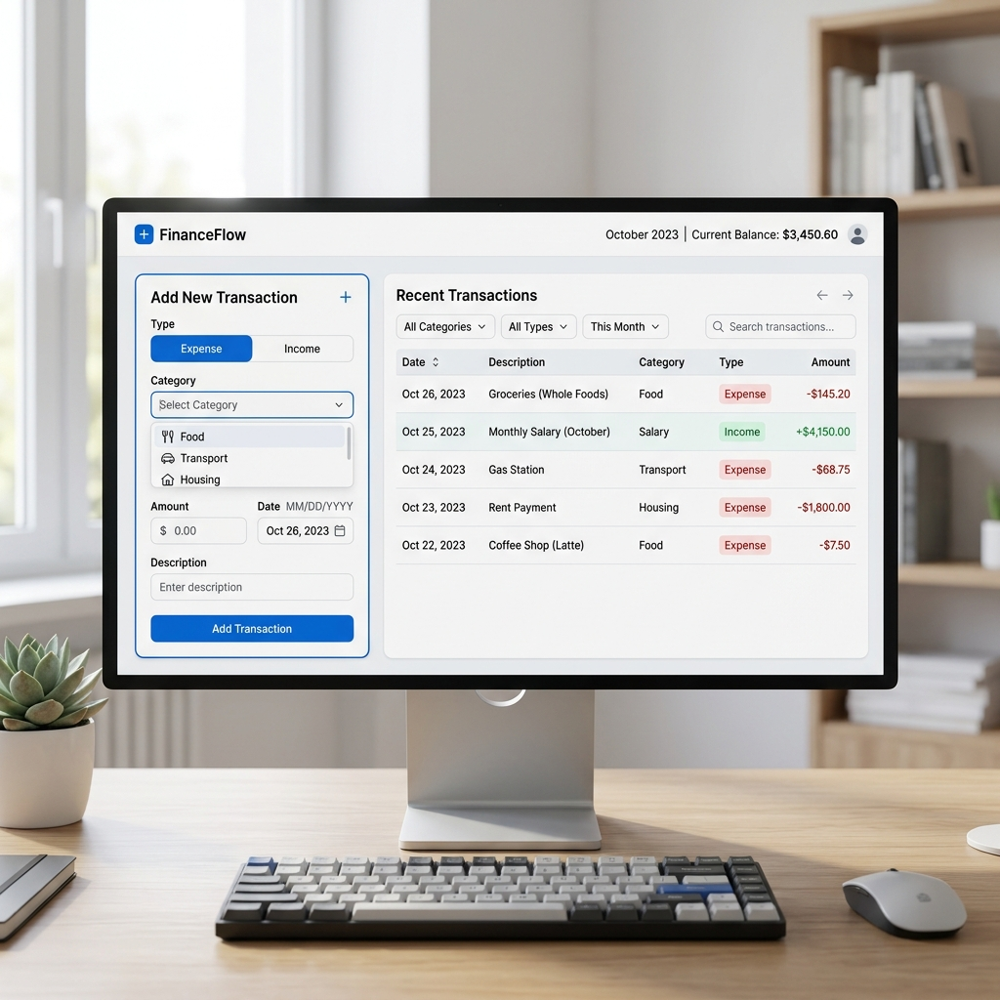
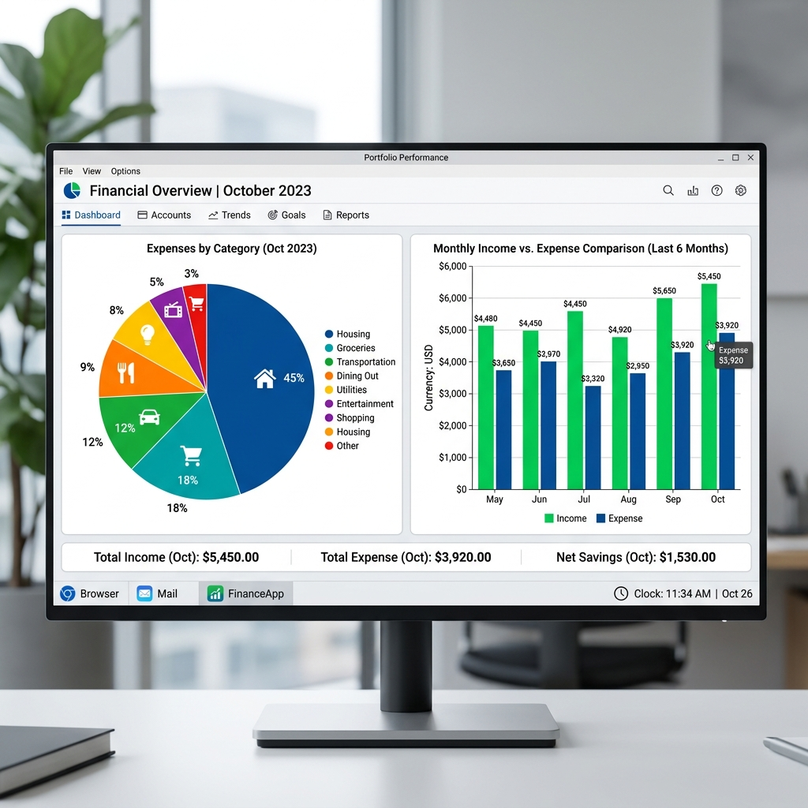

# Personal Finance Tracker

A robust, object-oriented desktop application built with Python and Tkinter for managing personal finances.

## Features

- **User Authentication:** Secure login and signup functionality.
- **Add Transactions:** Log both Income and Expenses with custom categories.
- **Categorization:** Automatically adapt category dropdowns based on transaction type.
- **Data Visualization:**
  - **Expense Pie Chart:** Visual breakdown of expenses by category.
  - **Income vs Expense Bar Chart:** Quick comparison of total income against total expenses.
- **Search & Filtering:** Easily search through past transactions by date, category, type, or description.
- **CSV Export:** Export your transaction history to a CSV file for external reporting.
- **Database:** Local SQLite database to persist users and transactions securely.

## Screenshots

### Login View


### Dashboard View


### Charts View


## Installation

1. Clone or download the repository.
2. Ensure you have Python 3 installed.
3. Create a virtual environment:
   ```bash
   python3 -m venv venv
   source venv/bin/activate  # On Windows use `venv\Scripts\activate`
   ```
4. Install dependencies:
   ```bash
   pip install -r requirements.txt
   ```
## Usage

Start the application by running:

```bash
python main.py
```

- **Step 1:** Click on "Sign Up" to create a new account.
- **Step 2:** Log in with your new credentials.
- **Step 3:** Use the Dashboard to add incomes and expenses.
- **Step 4:** View your financial health by clicking "View Charts".
- **Step 5:** Export your data anytime by clicking "Export to CSV".

## Architecture

This project is built using a strict Object-Oriented design pattern with a clear separation of concerns:
- `src/database/`: Handles all SQLite operations (`db_manager.py`).
- `src/models/`: Contains the entity classes (`user.py`, `transaction.py`).
- `src/gui/`: Manages the Tkinter UI and logic (`app.py`, `login_view.py`, `dashboard_view.py`, `charts_view.py`).
- `src/utils/`: Utility scripts like CSV exportation (`exporter.py`).
